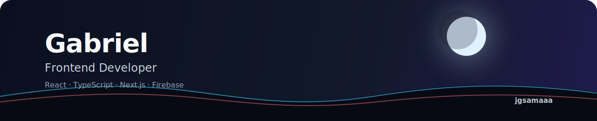

  

<h1 align="center">Gabriel / JGsamaaa</h1>

  Frontend developer building clean web projects with React, TypeScript, and a little anime inspiration.

  <a href="https://github.com/jgsamaaa?tab=repositories">Projects</a>
  ·
  <a href="https://github.com/jgsamaaa">GitHub</a>

## About

I like making websites and small tools that are simple, responsive, and easy to use.

Currently learning and building with React, TypeScript, Next.js, Firebase, and Tailwind CSS.

## Tech

  

## Projects

- [goaltracking](https://github.com/jgsamaaa/goaltracking) - goal tracking app
- [pixeldraw](https://github.com/jgsamaaa/pixeldraw) - creative drawing tool
- [compiler](https://github.com/jgsamaaa/compiler) - JavaScript experiment
- [portfoliophotographer](https://github.com/jgsamaaa/portfoliophotographer) - photographer portfolio template

  Thanks for visiting.

